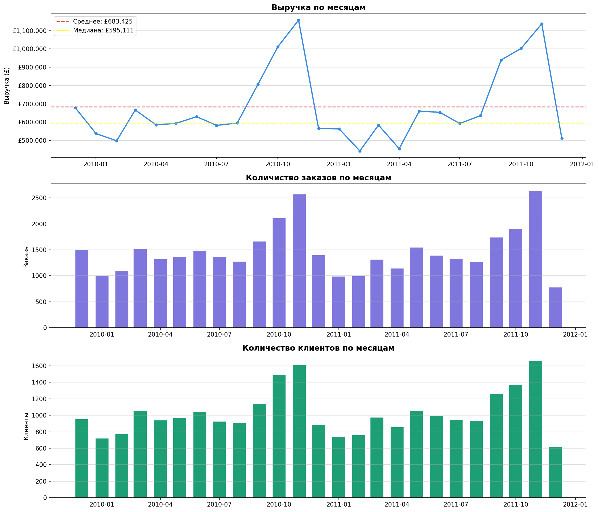
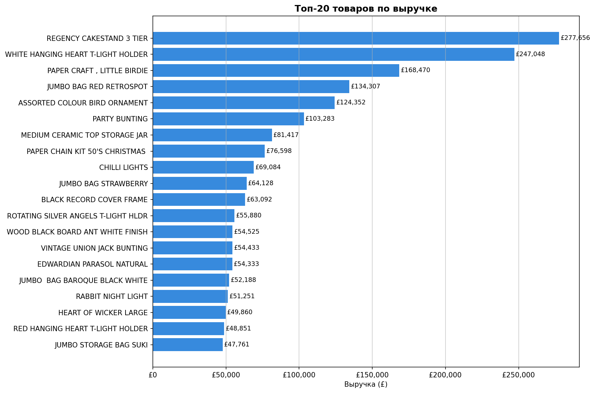
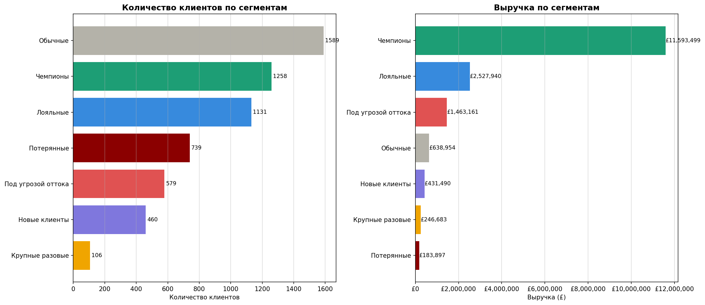
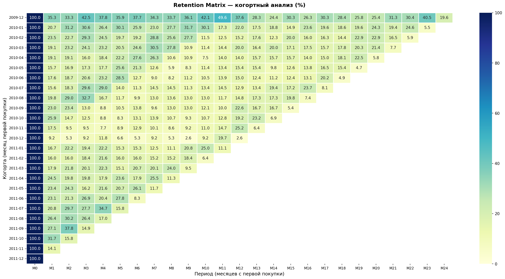
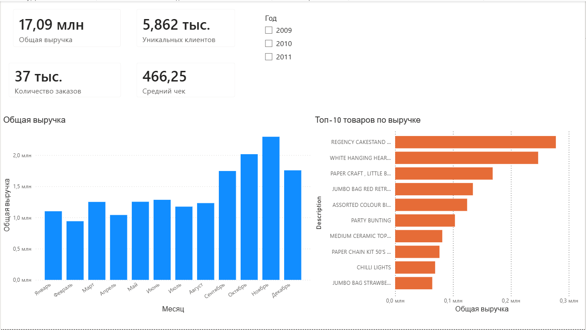
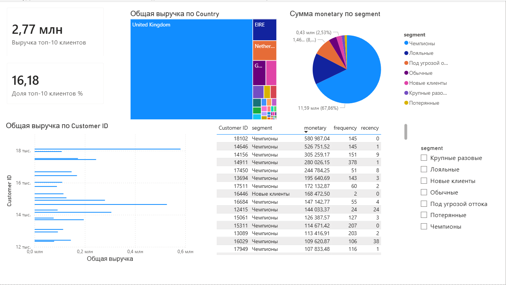
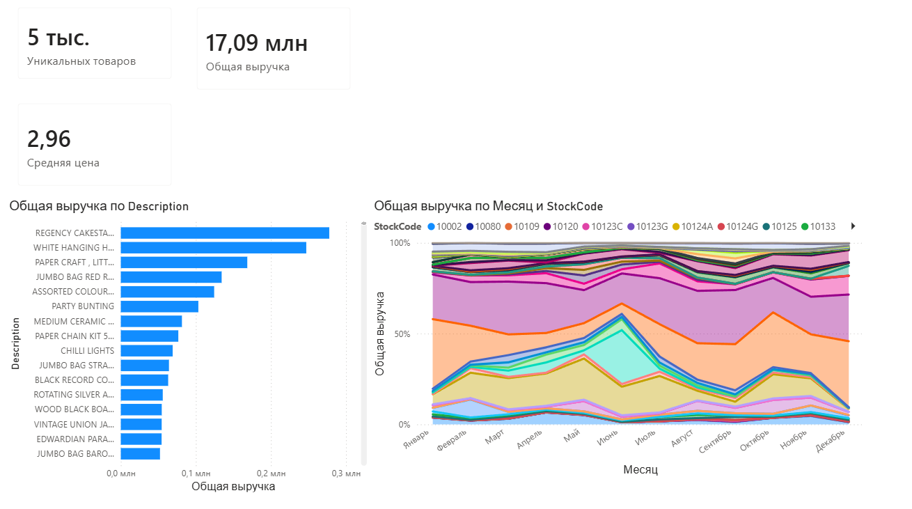

# E-commerce Retail Analysis

Анализ данных интернет-магазина на основе реального датасета Online Retail II (UCI).  
1 млн+ транзакций за 2009–2011 гг., 5862 уникальных клиента.

## Цель проекта
Провести полный цикл анализа данных: от очистки сырых данных до сегментации клиентов,  
с практикой SQL, Python и визуализации.

## Стек технологий

- **Python** — Pandas, Matplotlib, Seaborn, SQLAlchemy
- **PostgreSQL** — хранение данных, SQL-анализ
- **Power BI** — дашборд (в разработке)
- **Git** — контроль версий

## Структура проекта

| Ноутбук | Описание |
|---|---|
| `01_data_loading.ipynb` | Загрузка, очистка данных, заливка в PostgreSQL |
| `02_sql_analysis.ipynb` | SQL-анализ: оконные функции, топ товаров, MoM |
| `03_rfm_analysis.ipynb` | RFM-сегментация клиентов |

## Ключевые выводы

- **Сезонность** — пик выручки в октябре-ноябре (+70% к среднему),  
  минимум в январе-феврале
- **Топ-20 клиентов** генерируют ~18% всей выручки
- **Чемпионы** (21% базы) — главный сегмент по выручке
- **22% клиентской базы** под угрозой оттока или уже потеряны
- **Аномалия** — один оптовый заказ на 80 000 единиц товара

## Визуализации

### Выручка по месяцам

### Топ-20 товаров

### RFM-сегменты

### Когортный анализ — Retention Matrix

**Ключевые выводы:**
- Критический момент оттока — 1-й месяц: теряем 65-80% новых клиентов после первой покупки
- Декабрьские когорты самые лояльные — retention 30-40% vs 10-20% у остальных
- Сезонный всплеск в 11-й-12-й месяцы — клиенты возвращаются к следующему Рождеству
- После 2-ого месяца retention стабилизируется — если удержали 2 месяца, клиент остаётся надолго

## Дашборд Power BI

### Обзор продаж

### Клиенты и RFM сегменты

### Анализ товаров

## Датасет
[Online Retail II UCI](https://www.kaggle.com/datasets/mashlyn/online-retail-ii-uci) — 
реальные транзакции британского интернет-магазина за 2009–2011 гг.
